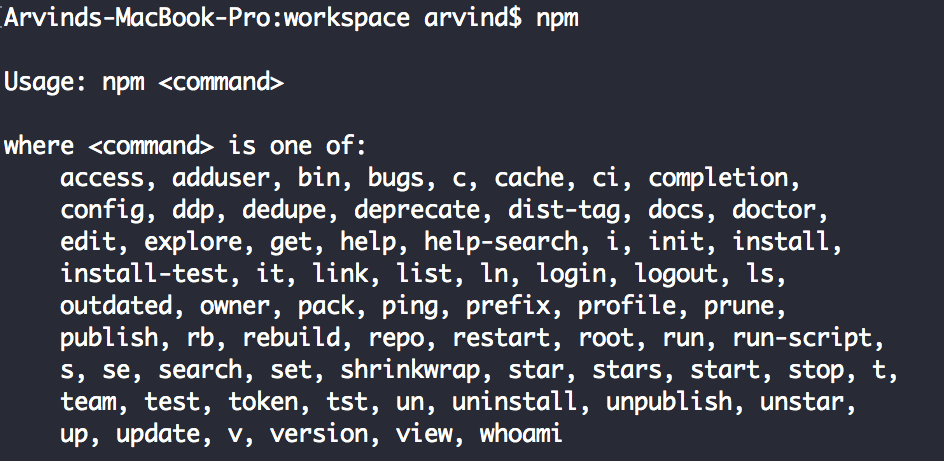
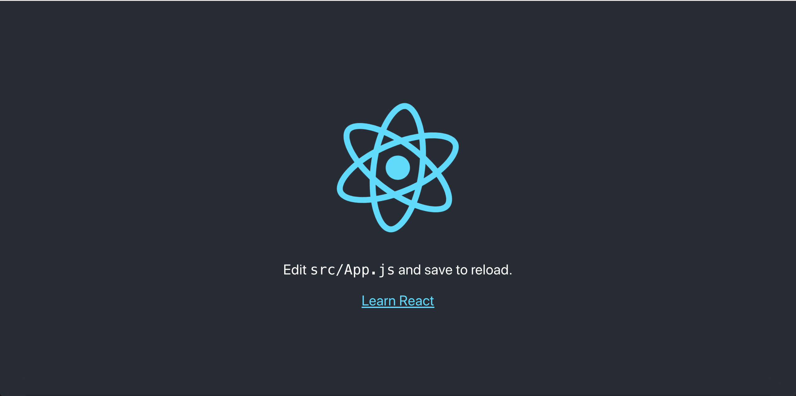
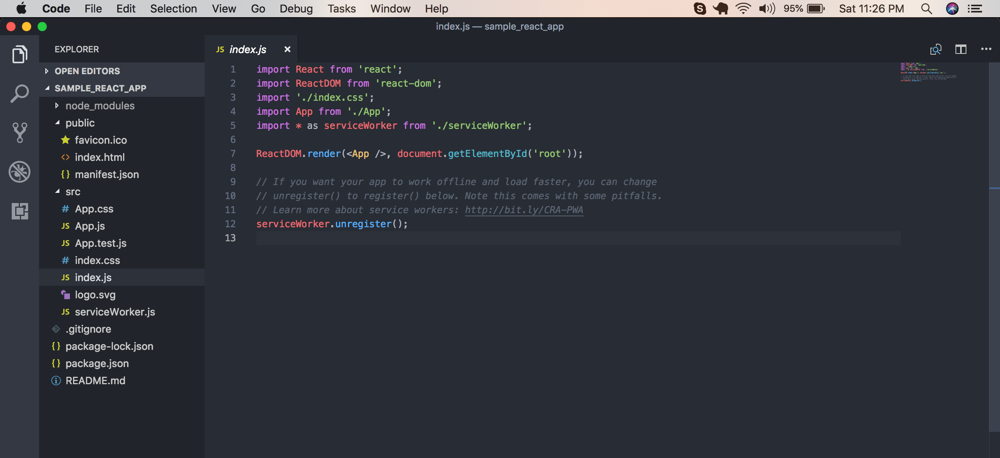
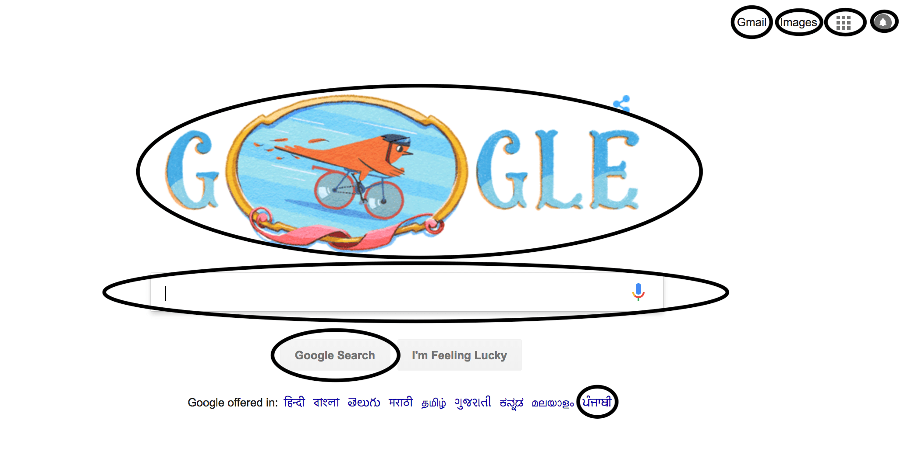
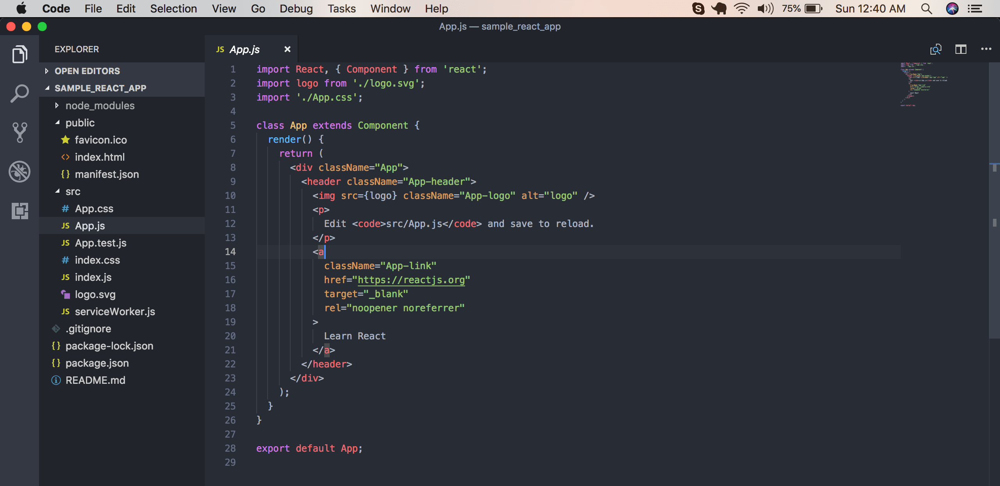
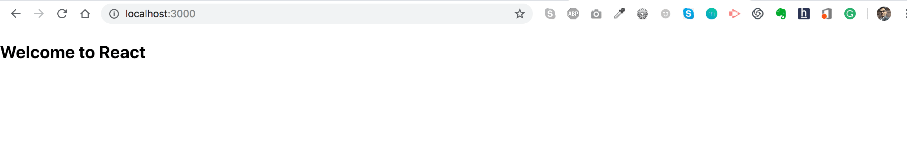
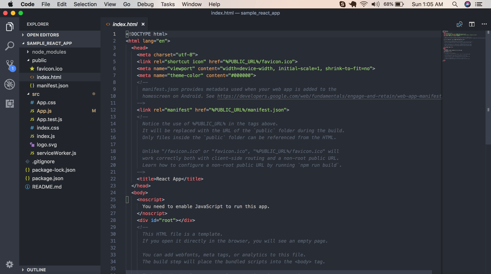

React.js is Javascript library to build UI. React handles V part of MVC. Below are the pre-requisite to get started with React.

1. HTML
2. CSS
3. Javascript
4. Node.js (Basics)
5. Node package manager (npm)

If you want to brush up those concepts, please learn it from another source. For Javascript, I can recommend reading it from the Mozilla site. They have one of best reference material on Javascript.

<a href="https://developer.mozilla.org/bm/docs/Web/JavaScript" target="_blank">Mozilla Javascript Tutorial</a>

In fact, they have material for node.js as well. For React you don’t need in-depth knowledge of Node but knowing how to import a module is important. Once you have covered the basics of the above concepts. You need to install Node in your machine to have npm.

Anyway, I’m going to cover some basics of Node.

### What is Node?

Node is the runtime environment for Javascript. With the help of Node, Javascript can perform server-side tasks like reading and writing to files, making operating system calls etc. Before 2009, Javascript was limited to browser-side only. Then one crazy person named <a href="https://en.wikipedia.org/wiki/Ryan_Dahl" target="_blank">Ryan Dahl</a> didn’t like how the I/O was done in the current servers. He presented the new paradigm in JS conference 2009. After that Javascript was never the same. If you are interested to watch the conference here is the <a href="https://www.youtube.com/watch?v=ztspvPYybIY" target="_blank">link.</a> I highly recommend watching at least for a few minutes so that you can appreciate his humility. His presentation was going to change the entire ecosystem of how I/O will be done and many people like us will be making living out of it.

### What is npm?

npm stands for node package manager. As I write this article there are more than 600,000 packages available to download. When you install Node, npm will be installed with it. Below is the link to download and install Node.

<a href="https://nodejs.org/en/" target="_blank">nodejs.org</a>

We have already completed pre-requisite for React. Let’s do some interesting stuff. Run npm command on the terminal to check npm is installed correctly. You should see the output something like below.



We are going to start with the boilerplate code provided by Facebook. By the way, did I tell you, React was invented at Facebook, from then it’s maintained by Facebook engineers. Thanks to them.

Run below command in your terminal

```
npm i create-react-app
```

If the command executed successfully then the package is installed. Now we have to create a React app. To create the app with the name **sample_react_app**, run below command. Navigate to the created folder. Run the command npm start.

```
create-react-app sample_react_app
cd sample_react_app
npm start
```

If you point your browser to http://localhost:3000, you should see below page. In that case, your installation and setup are working well. Congratulations.



Next, if you open the folder and see the folder structure, it will look like below.



Few things to note down. There are three main folders here. First is **node_modules**, it contains all the dependencies that our app will use. Second is the **public** folder, it contains public facing code and assets. Last is the most important one **src** folder. Most of the time you will be working inside this folder. Under the src folder, the file index.js is the entry point for our application. If you are a beginner, don’t focus on everything right now. It will be explained in the further tutorial. I would still want to talk about one line here.

```
ReactDOM.render(<App />, document.getElementById('root'));
```
Here, ReactDOM is a reference for the module **react-dom** which has a method called render. This method has two arguments, the first argument is what do you want to render and the second argument is where do you want to render.

### Let’s understand few core concepts in React.

My plan is not to introduce all the React concepts here. But there is one concept without which I feel we can’t proceed here. It’s called the **Components**.

### What is a Component in React?

Everything! Yes, everything you see in your browser elements they can be termed as a component. Take an example of any web application you have opened. It might have a header,side-bar, button, form etc. They can be called as components. Components can be further divided into components. This will be clear with below example. I took a screenshot of the homepage of Google. Observe the image.



I have marked some HTML elements with the oval shape. They all can be components. Your obvious next question should be, any benefit of doing that? I’m glad that you asked. Yes, it has benefits. The major two are, code reuse and modularity. Deep down React components can be expressed as a Javascript function or Javascript class. For today’s class let’s only focus on Component as Javascript function.

```
function Button(name){
    return(
        <div>
            <button type='button'>{name}</button>
        </div>
    );
}
```

Did you notice Google home has two buttons “Google Search” and “I’m Feeling Lucky”? If you have considered button as one component, you only have to write one method for the button and you can render it any number of times by passing required parameters. I parametrized only the name here but as we know the button has to perform a certain task when it’s clicked, we can pass that information in the parameter as well.

Now coming back to our sample application.

```
ReactDOM.render(<App />, document.getElementById('root'));
```

So, App is a React component which is rendered within the HTML element whose id is **root**. Where is **App** and where is **root** defined? App is imported in line 4.

```
import App from './App';
```

Its location is under the same folder under file name App. Let’s look at what it contains.



You can see here, they have defined App as a class component. We are going to modify it as a functional component. Delete all the content of App.js and replace it with below code.

```
import React from "react";

function App() {
  return (
    <div>
      <h2>Welcome to React</h2>
    </div>
  );
}

export default App;
```

Once you saved the code, the page will be reloaded and you should see below content in your browser.



Now the last thing to clarify is where is the **root**? Our application’s default landing page is index.html. Let’s look at what public/index.html looks like.



Notice the line number 28

```
<div id="root"></div>
```

This’s the place where all the application’s code gets rendered.

That’s all guys. I hope you understood the basics of it.

Feel free to provide your suggestions/feedbacks through comments.
