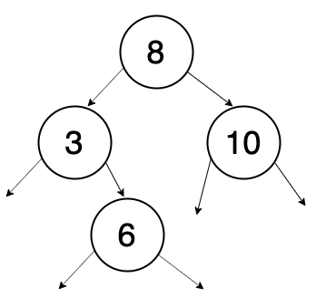
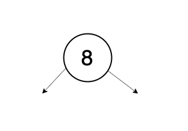
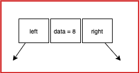
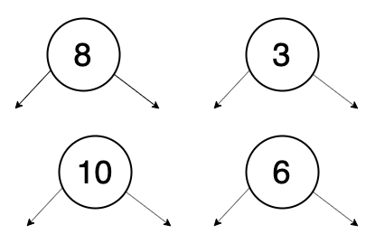
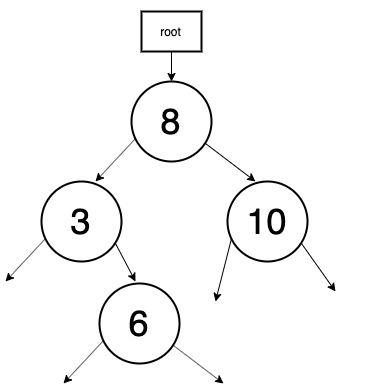

Sometimes it is intimidating to learn tree-related data structures. I will try to explain by breaking down the things in smaller pieces and then we will see how we can put them all together.

### Definition of Binary Search Tree:

All elements in the left subtree are smaller than the root element and all elements in the right subtree are greater than the root element. A typical binary search tree will look something similar to below.

*1. Binary Search Tree*

### Internals of each Node

Keeping that image in the mind, let’s start breaking it into smaller pieces. We will take only one element in the beginning and understand how it’s built. Take the first element, i.e. 8.

*2.The Single Node*

We need to find its constituent first before building more such elements. Like factories building tyres, we need to learn to build 1st tyre and then apply that learning and build more such tyres.


So, this has 3 elements, data, and two pointers. We call them a Node. The structure of the Node will look something like this. The data element is the one that stores the value of the node, left pointer stores reference of the left child and right pointer stores reference of the right child.

*3.Internals of a Node*

That was a pictorial representation of a Node. We need to define the same structure programmatically. Let’s try in javascript.

```java
class Node {
    int data;
    Node left;
    Node right;
    public Node(int data) {
        this.data = data;
        this.left = null;
        this.right = null;
    }
}
```

The above definition doesn’t create any Node, it just creates a blueprint of the Node. Using this blueprint, we will create our first Node and this below line does the magic.

```java
Node node_1 = new Node(8);
```

You can picture the 3rd image, it has created a Node with data 8 and both pointers pointing to nothing YET.

### More Nodes

You can create more Nodes now. Let say, I have created 3 more nodes

```java
Node node_2 = new Node(3);
Node node_3 = new Node(10);
Node node_4 = new Node(6);
```

Now you have 4 nodes total. The current picture is like below.

*4.More nodes*

### Connecting them together

We have created lot of nodes but they are not connected. Let’s connect them according to the definition of Binary Search Tree.

```java
node_1.left = node_2; // because node_2.data < node_1.data
node_1.right = node_3; // because node_3.data > node_1.data
node_2.right = node_4; // because node_4.data > node_2.data
```

Finally, you got the 1st image. Fantastic! You could built the Binary Search Tree.

*5.Binary Search Tree*

Likewise you can keep adding more nodes and link them keeping the right ordering as per the definition of the Binary Search Tree.

### Introducing Sanity into the System

In theory, that was all about Binary Search Tree. But it will become crazy after 10 nodes. You will find it difficult to manage the nodes. Just to provide a more systematic way to manage the nodes, we need to do something more. Before we jump into building the system, let’s list out the pain points that we have now without the system so that once the system is built we can appreciate it. The very first pain point is, when any new node is added to the system, it’s difficult to track, where my new node should go. The 2nd pain point is, how to track all the nodes that were inserted till now.

### Solving the Problem

I could directly introduce the term but I want you to relate it with a real-life example. There exists a tree and you want to climb the tree. Ideally, you would be looking for the root of the tree to start with. Once you have the root of the tree, you can climb the tree, you can pluck fruits or you can attach a few artificial fruits to it. (Nobody does that, are you kidding?). So, one thing we figured out we need root to start with. Coming back to our example, we start with nothing. As we add nodes, we need to make sure, root points to the first node. (Always!).

```java
class BST { 
    Node root;
    public BST() {
      this.root = null;
    }
}
```

If we just stop here and see what power it has now. Let’s build same nodes again and make sure root points to the first node.

```java
BST bst = new BST(); // root is null 
Node node_1 = new Node(8); // This is first node, root should point to this node 
bst.root = node_1;
Node node_2 = new Node(3);
node_1.left = node_2;
Node node_3 = new Node(10);
node_1.right = node_3;
Node node_4 = new Node(6);
node_2.right = node_4;
```

Here is the current picture.

*6.Feeling good to be rooted*

We have added the root to our tree, anybody wants to inspect (climb) all the elements can do so by starting at the root. We solved the problem of tracking but adding the nodes is still a challenge. We need to add a method to the BinarySearchTree class to add the nodes.

```java
public void addNode(int data) {

}
```

This method should use the blueprint created for Node.

```java
public void addNode(int data) {
    Node node = new Node(data);
}
```

When addNode() is invoked, by this time it has created a Node with given data. Keep in mind if it is the first node, the root should point to this node. Let’s add that check.

```java
public void addNode(int data) {
    Node node = new Node(data);
    if(this.root === null) {
        root = node;
    }
}
```

Great! You have added the first node and the root is also pointing to it. Now comes the challenging part. If it’s not the first node, where this node should go? We need the help of the root. We have the node and we have the root, we need to add another method that takes these two arguments and solves the problem for us, we don’t need to worry.

```java
public void addNode(int data) {
    Node node = new Node(data);
    if(this.root === null) {
        this.root = node;
    } else {
        this.insertNode(node, this.root);
    }
}
```

I lied to make you happy for 1 nanosecond, we need to worry about insertNode(). This method will insert the node depending upon its value.

```java
private void insertNode(Node node, Node root) {
    if(node.data < root.data) {
        if(root.left == null) {
            root.left = node; 
        } else {
            this.insertNode(node, root.left);
        }
    } else {
        if(root.right == null) {
            root.right = node;
        } else {
            this.insertMethod(node, root.right);
        }
    }
}
```

Bad! That was a hell lot of code thrown at once. Sorry, still figuring out how can I break it further. Anyway, it works. We have a systematic way to add more nodes to the system. Next, we wish to climb the tree and print all the nodes in sorted order. You can also explore different kinds of tree traversal algorithms <a href="https://en.wikipedia.org/wiki/Tree_traversal" target="_blank">here.</a>

```java
public void printInOrder(Node root) {
    if(this.root === null) {
        return;
    }
    this.printInOrder(root.left);
    System.out.println(root.data);
    this.printInOrder(root.right);
}
```

### Driver Program

```java
public static void main(String[] args) {
    BST bst = new BST();
    bst.addNode(8);
    bst.addNode(3);
    bst.addNode(10);
    bst.addNode(6);
    bst.printInOrder(bst.root); // prints 3,6,8,10
}
```

### Putting everything together

```java
class Node {
  int data;
  Node left;
  Node right;
  public Node(int data) {
    this.data = data;
    this.left = null;
    this.right = null;
  }
}

class BST {
    Node root;
    public BST() {
      this.root = null;
    }
    public void add(int data) {
        Node node = new Node(data);
        if(this.root == null) {
            this.root = node;
        } else {
            this.insertNode(node, this.root);
        }
    }
    private void insertNode(Node node, Node root) {
        if(node.data < root.data) {
            if(root.left == null) {
                root.left = node;
        } else {
            this.insertNode(node, root.left);
            }
        } else {
            if(root.right == null) {
                root.right = node;
            } else {
                this.insertNode(node, root.right);
            }
        }
    }
    public void printInorderBST(Node root) {
        if(root == null) {
            return;
        } 
        this.printInorderBST(root.left);
        System.out.println(root.data);
        this.printInorderBST(root.right);
   }
}

public class BSTDriver {
  public static void main(String[] args) {
    BST bst = new BST();
    bst.add(8);
    bst.add(3);
    bst.add(10);
    bst.add(6);
    bst.printInorderBST(bst.root); // prints 3,6,8,10   
  }
}
```

Hope you liked this tutorial.
You might also like other tutorials in this series <a href="/data-structure-fundamentals-in-java">here</a>