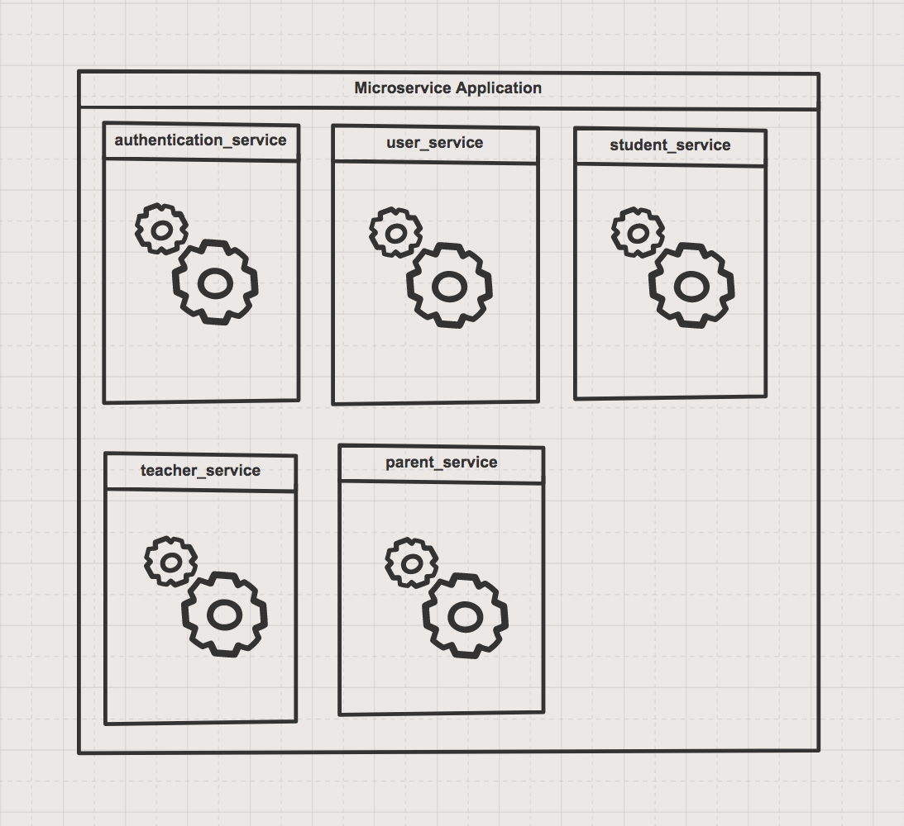

Cover photo credit: https://www.pexels.com*

In a short span of time Microservices architecture has gained a lot of popularity. To name a few, Amazon and Netflix have moved to Microservices. Let’s understand what are Microservices. I’m going to explain with the help of a sample application. You might appreciate more when nature of the product is complex.

### I. The Sample Product:
The product we are going to build for this tutorial will be called online education system. There will be two kinds of users, students, and teachers. A teacher can create course content. His/her dashboard will display the course content. When a student logs in,he/she can see different courses and its associated teachers. The student can opt for a particular course. After completing the course, a student can provide ratings for each course.

### II. Breaking down Further
Let’s break it down further. What are different actors involved in the application — students and teachers. We also want to add parents to the system. Parents can log in and create course curriculum and assign it to their kids(students).
We will not delve into the technicality of the application. We are going to divide the application according to its business capability and user management.

1. User management system.
2. Authentication system
3. Student’s operations and its data
4. Parent’s operations and its data
5. Teacher’s operations and its data

### III. Monolithic design of the application

According to wikipedia:

>In software engineering, a **monolithic application** describes a single-tiered software application in which the user interface and data access code are combined into a single program from a single platform.

Below is the monolith version of online_education_system. You put all the logic in one application.

*Monolith version of the application*

### IV. Microservices design of the application

According to wikipedia:

>**Microservices** is a variant of the service-oriented architecture (SOA) architectural style that structures an application as a collection of loosely coupled services.

Below is the Microservices version of the online_education_system. You divide the application into many smaller services and each service is loosely coupled.

*Microservices version of the application*

### V. Monolith Vs Microservices

If we talk about ease of starting to build an application, monolith comes as the first choice. In a monolith architecture, you don’t need to worry about service integration and communication unlike in microservices. But down the line, a few years later, code base becomes ugly, difficult to manage check-ins and other challenges.

### VI. The Choice — The Microservice Architecture

Microservice implementation is not easy and it comes with its price, and you should be ready for it. Multiple databases, testing, and deployment are the costly affair in the case of Microservices application.

>When you are building a complex product, you need to have the right mindset with long-term vision.

>Also, I would like to quote Fowler’s microservices design principles **“microservices are organized around business capabilities.”**

### VII. Upside of choosing Microservices Architecture

### a. Productivity.

This comes on top of the list. A lot can be achieved when services are clearly separated depending upon business capabilities. Even small teams can build more in less time because communication is done over HTTP/REST using JSON, the team always knows what other service’s response will be like. In the end, it will be more like stitching the services together with request and response.

### b. Neat and clean code base

Most of the code and logic separation comes with underlying architecture. It becomes easy for someone joining new to the team.

### c. Less interdependency

Each service is independent of another service. It gives a lot of freedom to the developers. Resulting in fewer code conflicts and more time spent on actual work.

### d. Scalability

The particular service with more loads can be deployed more. Below is the example of scaling out the student_service only.

*Scalling out a Microservices Application is very easy*

Think about scaling a Monolith application. You have to deploy the whole application.

### e. Liberty to choose different technical stack for each service.

Each service can have its own tech stack depending upon its core job. Let’s say one service’s job is to deal with more of system level operations, you can choose to write it in C++. There is another service whose job is to deal with a lot of data processing, python might be a better choice. You are not married to one language or platform.

### f. Extensibility

Tomorrow you want to add one more module that deals with business intelligence of the application. You can add one more Microservice with the name business_intelligence_service without affecting the existing application. Truly plug and play system.

Like every architecture, it has its downside and limitations too. You have to find out if the upside outweighs the downside for the problem you are trying to solve.

>Disclaimer: Having said that, microservices architecture seems fancy in the beginning and it becomes painful eventually. So, the last piece of advice is **move to microservices when it is required.**

If you like to read more about such articles, please do follow me. Also, if you are someone who loves to build things on cutting-edge technologies, I would love to hear from you.
