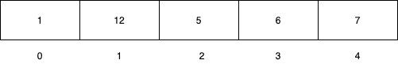

#### What is an Array?
Array is one many data structures in programming.
All the elements in the Array are stored in contiguous manner inside memory.
This is how you can visualize array.

*Figure 1.1*

Each box represents one memory location.
The number inside the box is the value that corresponding memory location holds. 

Below the box, the numering that starts from 0(zero) are called index.
Index is used to retrieve the array elements.

#### How to declare an Array?

Array declaration is quite simple.
This is how you can declare Array in Java.

```java
int numbers[];  // declaring the array
numbers = new int[100];   // allocating memory to array
```

Same can be done in single line.

```java
int numbers[] = new int[100];
```

Note: Providing the array size at the time of creation is must.

#### How to store values in the Array?

Using array index we can store values inside array.

```java
int numbers[] = new int[100];    // declaring and creating array of size 100
numbers[0] = 1; // storing value 1 at the index 0
numbers[1] = 12;
numbers[2] = 5;
numbers[3] = 6;
numbers[4] = 7;
```
We have created and stored values similar to the Figure 1.1.

#### How to access the Array elements?

Array index is used to access the array elements.(I know, I said something too obvious and silly!)

```java
System.out.println(numbers[0]); // prints => 1
```

#### Important methods and fields in an Array

In Java array is an object, so it inherits few methods and fields.
Most important field that will be most of the time is **length**.

**length**:
Java provides length field on array. This is how you can get the length of the array.

```java
System.out.println(numbers.length);  // prints => 100
```

#### Pros of using Array
Array is very simple and easy to use data structure. Along with that these are few more pros of using Array.

1. Data retrieval is quite fast - O(1).
2. Sorting and searching can be quite fast - O(nlogn)

#### Cons of using Array
It has some downside too.

1. Insertion is quite expensive - O(n).
2. Arrays cannot grow dynamically.

Hope you liked this tutorial.
You might also like other tutorials in this series <a href="/data-structure-fundamentals-in-java">here</a>