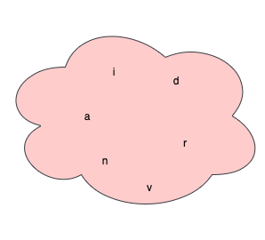

#### What is a String?

Observe the below picture for a good 10 seconds.

*Figure 1.1*

What do you see?
1. Lot of characters?
2. Do you see any meaning in them? hmmm for some character yes.

Next game. Now, let's arrange those characters in such a way that it becomes **arvind**. What? Yes, you get my name.

Let's arrange in such a way that it becomes **darvin**, may be someone else's name.

Anyway, thanks for playing.

WTF is your point Arvind?

My point is, when you arrange characters in certain way they become more meaninful. When you put together those characters they are also called **String** in some world. They does not need to be meaningful though.
But let's not fail to define formal definition of String.

Array of characters is called **String**.

#### How to create String in Java

This is how one can create String in Java.

```java
String name = "arvind";
```

There is another way to create String using **new** keyword.

```java
String name = new String("arvind");
```

#### Important methods and fields in String

When working with String, it's good to know some inbuilt methods and fields that would come handy when wrting code.

1. **length()** returns length of the string

```java
String name = "arvind";
System.out.println(name.length()); // Prints => 6
```

2. **charAt(int i)** return character at the index i

```java
String name = "arvind";
System.out.println(name.charAt(0)); // Prints => a
```
3. **concat(String s)** concat the string s

```java
String name = "arvind";
String fullName = name.concat(" pandey");
System.out.println(fullName);  // Prints => arvind pandey
```
4. **toCharArray()** convert string to character array

```java
String name = "arvind";
char[] nameArr = name.toCharArray();  // Converts to char array
```

5. **codePointAt(int i)** the code point value of the character at the index i

```java
String name = "arvind";
System.out.println(name.codePointAt(0));  // Prints => 97
```
6. **contains(String s)** true if this string contains s, false otherwise

```java
String name = "arvind";
System.out.println(name.contains("a")); // Prints => true
System.out.println(name.contains("b")); // Prints => false
```
7. **toUpperCase()** the String, converted to uppercase

```java
String name = "arvind";
System.out.println(name.toUpperCase());  // Prints => ARVIND
```

8. **toLowerCase()** the String, converted to lowercase

```java
String name = "Arvind Pandey";
System.out.println(name.toLowerCase()); // Prints => arvind pandey
```

There is huge list of other important methods inside String class. I leave it to you to explore further.

Hope you liked this tutorial.
You might also like other tutorials in this series <a href="/data-structure-fundamentals-in-java">here</a>