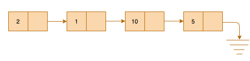
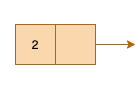
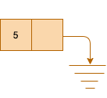

#### What is a LinkedList?

LinkedList is one many data structures in programming.
Unlike arrays, data is not stored in contiguous manner.
For that reason, each element also stores reference to the next element. Here is how you can visualize a singly linkedlist.

*Figure 1.1*

The elements inside box is the actual value and arrow indicates it stores reference to the next element. Each box is called a **node** in the programming world.

#### Different components of LinkedList

1. **value** is the actual data
2. **next** is the one which stores the next data reference
3. **head** is the pointer that maintains the reference 

#### Building the first node

Before we implement complete LinkedList, we need to understand how a single node is built. Later building list will be quite easy.

*Figure 1.2*

Observe the Figure 1.2, what all it has?

1. Data
2. Reference to the next data

Let try to declare a blueprint of that.

```java
class Node {
  int data;
  Node next;
}
```

Notice I said blueprint. That means, this will construct data type the way we defined in the class.

Now let's add <a href="https://en.wikipedia.org/wiki/Constructor_(object-oriented_programming)" target="_blank">constructor</a> that will be used to create such blueprints.

```java
class Node {
  int data;
  Node next;

  // The constructore
  
  public Node(int data) {
    this.data = data;
    this.next = null;
  }
}
```

We have blueprint ready, we have a way to build nodes. Let's build very first node.

```java
Node node = new Node(5);
```

You can imagine a node is created like below.

*Figure 1.3*

#### Building the list of node - LinkedList

We have mechanism to build nodes. We need something that can stitch them all. For that we need some pointer that stores reference of the first element so that LinkedList can be used in some meaningful way. That pointer is called head.

Let's see how we can do that.

```java
class LinkedList {
  Node head // This will store reference to the first element

  // The constructor to create the list
  public LinkedList() {
    this.head = null;
  }
}
```


Let's build the list.

```java
LinkedList list = new LinkedList();
```

We created a LinkedList, but nothing is there yet. We need method to insert values in the list.

```java
class LinkedList{
  ...
  ...

  // To insert new node
  public void insertNode(int data) {
    Node node = new Node(data);   // construct the node using given data

    // Check if this is the very first node
    if(head == null) {
      head = node;
    } else { // if not
      Node temp = head; // start from the beginning
      while(temp.next != null) { // Go until you reach last
        temp = temp.next;
      }
      temp.next = node; // Once you reached last, assign its next pointer to new node
      node.next = null; // New node's next has to point to null now.
    }
  }

  // to print all the nodes
  public void printList() {
    if(head == null) { // If it has no nodes
      return; // just return
    }
    Node temp = head; // Otherwise start from the beginning
    while(temp != null) { // Go till end and print the data
      if(temp.next == null ) {
        System.out.print(temp.data);
      } else {
        System.out.print(temp.data+" --> ");
      }
      temp = temp.next;
    }
  }
  ...
  ...
}
```

Let's create a driver class that will use the utility we defined earlier create working program.

```java
public class Driver {
  public static void main(String[] args) {
    LinkedList list = new LinkedList();
    list.insertNode(2);
    list.insertNode(1);
    list.insertNode(10);
    list.insertNode(5);
    list.printList(); // This prints => 2 --> 1 --> 10 --> 5
  }
}
```

Hope you liked this tutorial.
You might also like other tutorials in this series <a href="/data-structure-fundamentals-in-java">here</a>