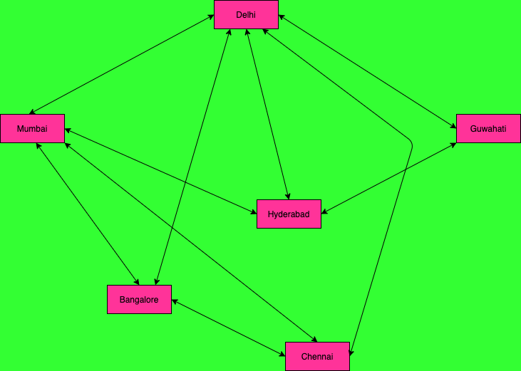
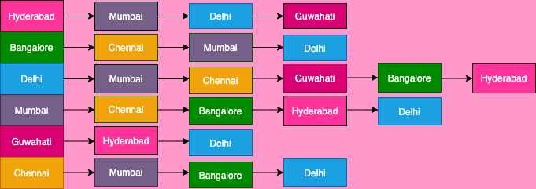
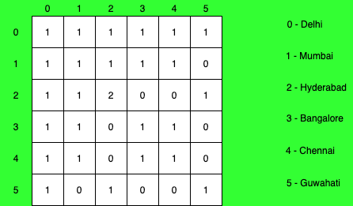

Cover photo by <a href="https://unsplash.com/@clintadair" target="_blank">Clint Adair</a>   on  <a href="https://unsplash.com/" target="blank">unsplash</a>

### Graph

#### What is Graph?
Graph is one of the data structures in computer programming.
Below is a sample airport route between cities. Bi-directional arrow indicates that flights fly both way.

*Figure 1.1*

Say, we need a data structure to represent such scenario. Then graph data structure is the one that comes to the rescue. Or one another example of graph data structure is social networks, i.e facebook.

#### Graph Terminologies

**Vertex(V):** Each end-point is called vertex. Like cities are vertices here.

**Edge(E):** The line that connects two vertices is called edge.

**Graph(G):** The complete arrangement is called Graph.

#### How to represent the Graph?

There are different ways to represent graph. Two are most popular one.

1. **Adjacency List**
2. **Adjacency Matrix**


#### Adjacency List representation of the Graph
In this representaion, you store the adjacent vertext as list.

*Figure 1.2*


#### Adjacency Matrix representation of the Graph

In this representation, each vertex is represented as index of a 2-d array of size V*V. Where is V is the total number of vertices.
If there is connection between vertices, then you store 1 at the corresponding coordinate, if not then you store 0.
Here 0 means Delhi and 1 means Mumbai.
The coordinate (0,0) means, connection between Delhi and Delhi.
That has to be true, each vertex is reachable to its own. So it stores value 1. The coordinate (0,1) means connection between Delhi and Mumbai. Similarly the coordinate (1, 0) means connection between Mumbai and Delhi.

Notice: If all the edges are bi-directional then resulting matirx would be a symmetric matrix.

*Figure 1.3*

#### Which representation is better?

That's quite debatable. If the resulting matrix is sparse matrix then you will end up storing a lot of 0's in the matrix, for that matter you do not care much about them. You care more about what's connected. In that case adjacency list is better. But, in another case, if the connectivity is dense and you expect all the vertices are mostly connected then adjacency matrix is better than adjacency list.

For our illustration, we will use adjacency list.

#### Graph Implementation - Adjacency List


```java
import java.util.ArrayList;
import java.util.HashMap;

public class AdjacencyGraph {
    private HashMap<String, ArrayList<String>> graph= new HashMap<>();
    public AdjacencyGraph(String[] arr) {
        for(int i=0; i<arr.length; i++) {

            graph.put(arr[i], new ArrayList<>());
        }
    }

    // Assuming bi-directional graph
    public void add(String src, String dst) {
        graph.get(src).add(dst);
        graph.get(dst).add(src);
    }

    public void printGraph() {
        for(String s: graph.keySet()) {
            ArrayList<String> a = graph.get(s);
            System.out.print(s+"-->");
            for(int k=0;k<a.size();k++) {
                if(k == a.size()-1) {
                    System.out.print(a.get(k));
                } else {
                    System.out.print(a.get(k)+"-->");
                }

            }
            System.out.println();
        }
    }

    public static void main(String[] args) {
        String[] arr = {"Hyderabad", "Delhi", "Bangalore", "Chennai", "Mumbai", "Guwahati"};
        AdjacencyGraph graph = new AdjacencyGraph(arr);
        graph.add("Hyderabad","Mumbai");
        graph.add("Hyderabad","Delhi");
        graph.add("Hyderabad","Guwahati");
        graph.add("Bangalore","Chennai");
        graph.add("Bangalore","Mumbai");
        graph.add("Bangalore","Delhi");
        graph.add("Delhi","Mumbai");
        graph.add("Delhi","Chennai");
        graph.add("Delhi","Guwahati");
        graph.add("Mumbai","Chennai");
        graph.printGraph();
    }
}
```

**Console Output**

```console
Delhi-->Hyderabad-->Bangalore-->Mumbai-->Chennai-->Guwahati
Guwahati-->Hyderabad-->Delhi
Chennai-->Bangalore-->Delhi-->Mumbai
Mumbai-->Hyderabad-->Bangalore-->Delhi-->Chennai
Hyderabad-->Mumbai-->Delhi-->Guwahati
Bangalore-->Chennai-->Mumbai-->Delhi
```

Hope you liked this tutorial.
You might also like other tutorials in this series <a href="/data-structure-fundamentals-in-java">here</a>